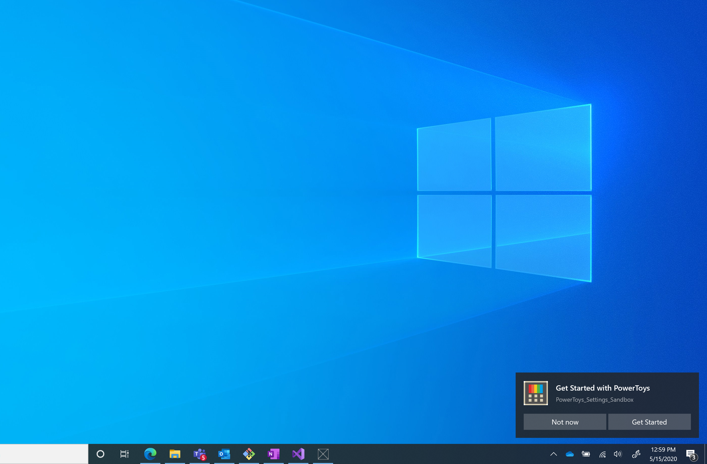
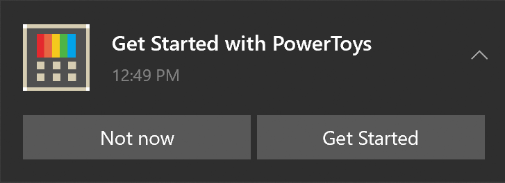
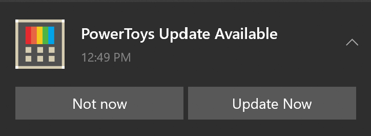
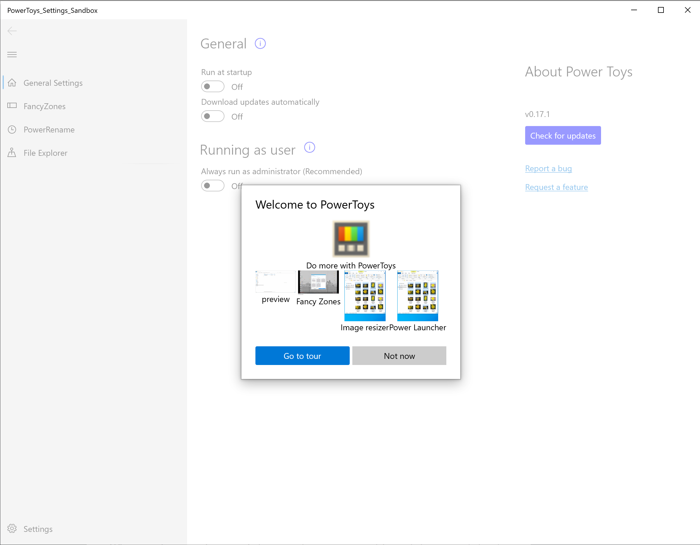

# PowerToys Out Of Box Experience Proposal and Code

##### Developers: [Furaha Damién](https://github.com/furahadamien), [Letitia Kwan](https://github.com/letitiakwan), [Jessica Lim](https://github.com/JessicaLim8)
##### Program Manager : [Eunice Choi](https://github.com/eunicechoi98)
##### Designer : Rafael Flora

## Overview
A team of Microsoft Garage interns have created a proposal for the out-of-box experience after the first time install of the PowerToys app, and a proposal for the UI experience of updates.

## 1. Notification Toasts

### Rationale:
Notify users when they installed **PowerToys** or if a new update has been applied to **PowerToys**. Clicking on the notifications will trigger the appropriate OOBE experience - either a *First Install* popup & walkthrough or a *New Update* popup.

### Design:


#### Overall Structural design
- Toasts are a notification service located in [Services/NotificationServices.cs](https://github.com/microsoft/PowerToys/blob/interns/dev-oobe/POC-OOBE/OOBE-Sandbox/PowerToys%20Settings%20Sandbox/Services/NotificationService.cs)
- When notifications are clicked, they activate OnActivated located in [App.xaml.css](https://github.com/microsoft/PowerToys/blob/interns/dev-oobe/POC-OOBE/OOBE-Sandbox/PowerToys%20Settings%20Sandbox/App.xaml.cs) On activated will redirect to the MainPage with a parameter
- Navigation to the MainPage will cause the appropriate OOOBE experience to appear (see [Views/MainPage.xaml.cs](https://github.com/microsoft/PowerToys/blob/interns/dev-oobe/POC-OOBE/OOBE-Sandbox/PowerToys%20Settings%20Sandbox/Views/MainPage.xaml.cs)
- SandBox notifications function was included in [App.xaml.css](https://github.com/microsoft/PowerToys/blob/interns/dev-oobe/POC-OOBE/OOBE-Sandbox/PowerToys%20Settings%20Sandbox/App.xaml.cs) to fake the process, but the notifications should be triggered in the apporpriate locations in powertoys 

#### Toast Design
The toasts are all designed to notify the users about **PowerToys** when they do not have the app open. Three seperate toasts were designed using the same base structure. Every toast includes a message, a button to launch the app, and a button to dismiss the notification
1. Geting Started with Powertoys: displayed on install
   - Redirects to the New Install popup (see section 2)



2. New PowerToys Update: displayed on new update
   - Redirects to the New update popup (see section 6)


3. New PowerToys Update Available: displayed to users who do not have autoupdate on (toast was created but does not direct anywhere)



### How to implement:
#### Implement toast notifications
1. Remove the sandboxNotifications function in [App.xaml.css](https://github.com/microsoft/PowerToys/blob/interns/dev-oobe/POC-OOBE/OOBE-Sandbox/PowerToys%20Settings%20Sandbox/App.xaml.cs) 
2. Include the correct NotificationService call whenever the app is updated or first installed
`NotificationService.AppInstalledToast()` or `NotificationService.AppUpdatedToast()` or `NotificationService.AppNeedsUpdateToast`
3. Ensure the onNaviated to function from [Views/MainPage.xaml.cs](https://github.com/microsoft/PowerToys/blob/interns/dev-oobe/POC-OOBE/OOBE-Sandbox/PowerToys%20Settings%20Sandbox/Views/MainPage.xaml.cs) is included in the mainPage

### Considerations
- Toasts were used due to the simplicity of adding Windows Toasts to a UWP app
  - Pros: benefit of being built into the normal notifications
  - Cons: will not be seen by users on "Do not disturb", will not show the direct location on the sys tray
- SystemInformation from the UWP Community toolkit was used to recognize flags for first install and first open since update
  - Statements can be replaced with flags already within the powertoys app
  - ApplicationData LocalSettings can also be used
  `var localSettings = ApplicationData.Current.LocalSettings;` using the local settings, `localSettings.Values[IsFirstRun]` and `localSettings.Values[currentVersion]` can be accessed to determine the apps current state. This usage will also allow you to override the local settings
- Toasts are all deleted onlaunch using `ToastNotificationManager.History.Clear()`
  - This can be removed so that notifications are not removed
  - Group tags can also be used to remove the notifications of a certain type (i.e. install) when the appropriate popup is shown by adding ToastNotificationManager.History.RemoveGroup("groupname") to the onNavigate function in MainPage.xaml.cs
  - Group tags can be seen in NotificationServices under toast.group

## 2. Welcome Screen

#### Rationale:
PowerToys v17 has a silent launch after first time installation and update. As evidenced in issue [#1285](https://github.com/microsoft/PowerToys/issues/1285), users are left wondering if anything happened at all. The aim of this new feature is to allow users a chance to appreate the install/update of PowerToys while at the same time giving them a chance to explore what PowerToys has to offer if they so wish to. 

#### Design:

*Welcome window*


#### Code:

#### Considerations:

## 3. Adaptive Sizing Layout Change

#### Rationale: 
When the General Settings window is minimized, the "About Feature" section goes to the bottom of Settings - harder to find when there are lots of settings. We propose moving the "About Feature" section to the top of the Settings when minimized.

#### Design:

 Extended window UI
 Smaller window UI 
>>>>>>> 44e3cb838e914bb1c99762e3aaa0dd01101128bb

#### Code:
The frontend and the backend for this window are in [onLaunchContentDialog.xaml](https://github.com/microsoft/PowerToys/blob/interns/dev-oobe/POC-OOBE/OOBE-Sandbox/PowerToys%20Settings%20Sandbox/Views/onLaunchContentDialog.xaml) and [onLaunchContentDialog.xaml.cs](https://github.com/microsoft/PowerToys/blob/interns/dev-oobe/POC-OOBE/OOBE-Sandbox/PowerToys%20Settings%20Sandbox/Views/onLaunchContentDialog.xaml.cs) respectively. It is later called in the [MainPage.xaml.cs](https://github.com/microsoft/PowerToys/blob/interns/dev-oobe/POC-OOBE/OOBE-Sandbox/PowerToys%20Settings%20Sandbox/Views/MainPage.xaml.cs) as below:

The following Grid would exist as each tool's Grid element on their repective settings page. Add styling as necessary. Check out '/PowerToys Settings Sanbox/Views/FancyZonesPage.xaml' to see it in action:

```
 private async void powerOnLaunchDialog()
        {
            onLaunchContentDialog dialog = new onLaunchContentDialog();
            dialog.PrimaryButtonClick += Dialog_PrimaryButtonClick;
            await dialog.ShowAsync();
        }

        private void Dialog_PrimaryButtonClick(ContentDialog sender, ContentDialogButtonClickEventArgs args)
        {
            OpenFirstGeneralSettingsTip();
        }
```

#### Considerations:
The aim of the feature is to introduce PowerToys to the user while at the same time not getting in their way. To achieve this we decided to use a [contentDialog](https://docs.microsoft.com/en-us/uwp/api/Windows.UI.Xaml.Controls.ContentDialog?view=winrt-19041). This allows the user to either explore PowerToys features as soon as they install/update the application or do the exploration at a later time. For users who chose the latter, The window privides animated gifs that give a glimpse of what PowerToys has to offer. Using a contentDialog also allows us to fire a toast notifcation at a later time.

    <Grid>

        <VisualStateManager.VisualStateGroups>
            <VisualStateGroup x:Name="LayoutVisualStates">
                <VisualState x:Name="WideLayout">
                    <VisualState.StateTriggers>
                        <AdaptiveTrigger MinWindowWidth="{INSERT WIDE LAYOUT WINDOW WIDTH HERE}" />
                    </VisualState.StateTriggers>
                    <VisualState.Setters>
                        <Setter Target="SidePanel.(Grid.Column)" Value="1" />
                        <Setter Target="SidePanel.(Grid.Row)" Value="1" />
                        <Setter Target="ToolSettingsTitle.(Grid.Row)" Value="0" />
                        <Setter Target="ToolSettingsView.(Grid.Row)" Value="1" />
                    </VisualState.Setters>
                </VisualState>
                <VisualState x:Name="SmallLayout">
                    <VisualState.StateTriggers>
                        <AdaptiveTrigger MinWindowWidth="{INSERT MIN LAYOUT WINDOW WIDTH HERE}" />
                    </VisualState.StateTriggers>
                    <VisualState.Setters>
                        <Setter Target="SidePanel.(Grid.Column)" Value="0" />
                        <Setter Target="SidePanel.(Grid.Row)" Value="1" />
                        <Setter Target="SidePanel.(Orientation)" Value="Horizontal" />
                        <Setter Target="ToolSettingsView.(Grid.Row)" Value="2" />
                    </VisualState.Setters>
                </VisualState>
            </VisualStateGroup>
        </VisualStateManager.VisualStateGroups>


        <Grid.ColumnDefinitions>
            <ColumnDefinition Width="*"/>
            <ColumnDefinition Width="Auto"/>
        </Grid.ColumnDefinitions>
        <Grid.RowDefinitions>
            <RowDefinition Height="Auto"/>
            <RowDefinition Height="Auto" />
            <RowDefinition Height="Auto" />
        </Grid.RowDefinitions>


        <StackPanel x:Name="ToolSettingsTitle" Orientation="Vertical" >
                { INSERT TITLE AND DESCRIPTION HERE }
        </StackPanel>

        <StackPanel x:Name="SidePanel" Grid.Column="1" Orientation="Vertical" HorizontalAlignment="Left">
            <Image Source="{INSERT GIF OR IMAGE OF TOOL HERE}">
            <StackPanel x:Name="SidePanelText" Grid.Column="1" Orientation="Vertical" HorizontalAlignment="Left">
                { INSERT SIDE PANEL TEXT HERE }
            </StackPanel>
        </StackPanel>

        <StackPanel  x:Name="ToolSettingsView" Orientation="Vertical">
            { INSERT TOOL SETTINGS HERE }
        </StackPanel>
    </Grid>
```

